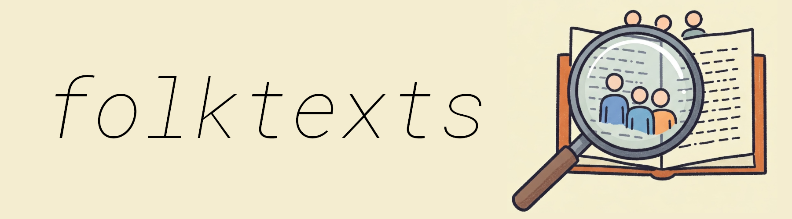
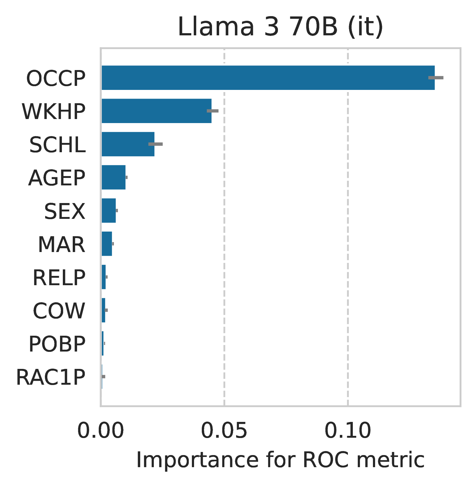

 <!-- # Folktexts   <!-- omit in toc -->


[](https://huggingface.co/datasets/acruz/folktexts)




<h2>A toolbox for evaluating statistical properties of LLMs</h2>

Folktexts provides a suite of Q&A datasets for evaluating **uncertainty**, **calibration**, **accuracy** and **fairness** of LLMs on individual outcome prediction tasks. It provides a flexible framework to derive prediction **tasks from survey data**, translates them into natural text prompts, extracts LLM-generated _risk scores_, and computes statistical properties of these risk scores by comparing them to the ground truth outcomes.

**Use folktexts to benchmark your LLM:** 

- Pre-defined Q&A benchmark tasks are provided based on data from the American Community Survey (<a href="https://www.census.gov/programs-surveys/acs/microdata/documentation.html">ACS</a>). Each tabular prediction task from the popular 
[folktables](https://github.com/socialfoundations/folktables) package is made available 
as a natural-language Q&A task.
- Parsed and ready-to-use versions of each *folktexts* dataset can be found on 
<a href="https://huggingface.co/datasets/acruz/folktexts"> Huggingface</a>.
- The package can be used to customize your tasks. Select a feature to define your prediciton target. Specify subsets of input features to vary outcome uncertainty. Modify prompting templates to evaluate mappings from tabular data to natural text prompts. Compare different methods to extract uncertainty values from LLM responses. Extract raw risk scores and outcomes to perform custom statistical evaluations. Package documentation can be found [here](https://socialfoundations.github.io/folktexts/).

<!--  -->
<p align="center">
    
</p>


## Table of contents   <!-- omit in toc -->
- [Getting started](#getting-started)
  - [Installing](#installing)
  - [Basic setup](#basic-setup)
  - [Ready-to-use datasets](#ready-to-use-datasets)
  - [Example usage](#example-usage)
- [Benchmark features and options](#benchmark-features-and-options)
- [Evaluating feature importance](#evaluating-feature-importance)
- [FAQ](#faq)
- [Citation](#citation)
- [License and terms of use](#license-and-terms-of-use)


## Getting started

### Installing

Install package from [PyPI](https://pypi.org/project/folktexts/):

```
pip install folktexts
```

### Basic setup
> Go through the following steps to run the benchmark tasks.
> Alternatively, if you only want ready-to-use datasets, see [this section](#ready-to-use-datasets).

1. Create conda environment

```
conda create -n folktexts python=3.11
conda activate folktexts
```

2. Install folktexts package

```
pip install folktexts
```

3. Create models dataset and results folder

```
mkdir results
mkdir models
mkdir data
```

4. Download transformers model and tokenizer
```
download_models --model 'google/gemma-2b' --save-dir models
```

5. Run benchmark on a given task

```
run_acs_benchmark --results-dir results --data-dir data --task 'ACSIncome' --model models/google--gemma-2b
```

Run `run_acs_benchmark --help` to get a list of all available benchmark flags.

### Ready-to-use datasets

Ready-to-use Q&A datasets generated from the 2018 American Community Survey are available via
<a href="https://huggingface.co/datasets/acruz/folktexts">
<span style="display: inline-block; vertical-align: middle;">
    
</span>
datasets</a>.

```py
import datasets
acs_task_qa = datasets.load_dataset(
    path="acruz/folktexts",
    name="ACSIncome",   # Choose which task you want to load
    split="test")       # Choose split according to your intended use case
```


### Example usage

Example code snippet that loads a pre-trained model, collects and parses Q&A data
for the income-prediction task, and computes risk scores on the test split.

```py
# Load transformers model
from folktexts.llm_utils import load_model_tokenizer
model, tokenizer = load_model_tokenizer("gpt2")   # using tiny model as an example

from folktexts.acs import ACSDataset
acs_task_name = "ACSIncome"     # Name of the benchmark ACS task to use

# Create an object that classifies data using an LLM
from folktexts import TransformersLLMClassifier
clf = TransformersLLMClassifier(
    model=model,
    tokenizer=tokenizer,
    task=acs_task_name,
)
# NOTE: You can also use a web-hosted model like GPT4 using the `WebAPILLMClassifier` class

# Use a dataset or feed in your own data
dataset = ACSDataset.make_from_task(acs_task_name)   # use `.subsample(0.01)` to get faster approximate results

# You can compute risk score predictions using an sklearn-style interface
X_test, y_test = dataset.get_test()
test_scores = clf.predict_proba(X_test)
```

If you only care about the overall benchmark results and not individual predictions,
you can simply run the following code instead of using `.predict_proba()` directly:
```py
from folktexts.benchmark import Benchmark, BenchmarkConfig
bench = Benchmark.make_benchmark(
    task=acs_task_name, dataset=dataset,  # These vars are defined in the snippet above
    model=model, tokenizer=tokenizer,
    numeric_risk_prompting=True,    # See the full list of configs below in the README
)
bench_results = bench.run(results_root_dir="results")
```

Example snippet showcasing how to fit the binarization threshold on a few training samples
(note that this is *not fine-tuning*), and obtaining discretized predictions using `.predict()`.
```py
# Optionally, you can fit the threshold based on a few samples
clf.fit(*dataset[0:100])    # (`dataset[...]` will access training data)

# ...in order to get more accurate binary predictions with `.predict`
test_preds = clf.predict(X_test)
```


## Benchmark features and options

Here's a summary list of the most important benchmark options/flags used in
conjunction with the `run_acs_benchmark` command line script, or with the
`Benchmark` class.

| Option | Description | Examples |
|:---|:---|:---:|
| `--model` | Name of the model on huggingface transformers, or local path to folder with pretrained model and tokenizer. Can also use web-hosted models with `"[provider]/[model-name]"`. | `meta-llama/Meta-Llama-3-8B`, `openai/gpt-4o-mini` |
| `--task` | Name of the ACS task to run benchmark on. | `ACSIncome`, `ACSEmployment`  |
| `--results-dir` | Path to directory under which benchmark results will be saved. | `results` |
| `--data-dir` | Root folder to find datasets in (or download ACS data to). | `~/data` |
| `--numeric-risk-prompting` | Whether to use verbalized numeric risk prompting, i.e., directly query model for a probability estimate. **By default** will use standard multiple-choice Q&A, and extract risk scores from internal token probabilities. | Boolean flag (`True` if present, `False` otherwise) |
| `--use-web-api-model` | Whether the given `--model` name corresponds to a web-hosted model or not. **By default** this is False (assumes a huggingface transformers model). If this flag is provided, `--model` must contain a [litellm](https://docs.litellm.ai) model identifier ([examples here](https://docs.litellm.ai/docs/providers/openai#openai-chat-completion-models)). | Boolean flag (`True` if present, `False` otherwise) |
| `--subsampling` | Which fraction of the dataset to use for the benchmark. **By default** will use the whole test set. | `0.01` |
| `--fit-threshold` | Whether to use the given number of samples to fit the binarization threshold. **By default** will use a fixed $t=0.5$ threshold instead of fitting on data. | `100` |
| `--batch-size` | The number of samples to process in each inference batch. Choose according to your available VRAM. | `10`, `32` |


Full list of options:

```
usage: run_acs_benchmark [-h] --model MODEL --results-dir RESULTS_DIR --data-dir DATA_DIR [--task TASK] [--few-shot FEW_SHOT] [--batch-size BATCH_SIZE] [--context-size CONTEXT_SIZE] [--fit-threshold FIT_THRESHOLD] [--subsampling SUBSAMPLING] [--seed SEED] [--use-web-api-model] [--dont-correct-order-bias] [--numeric-risk-prompting] [--reuse-few-shot-examples] [--use-feature-subset USE_FEATURE_SUBSET]
                         [--use-population-filter USE_POPULATION_FILTER] [--logger-level {DEBUG,INFO,WARNING,ERROR,CRITICAL}]

Benchmark risk scores produced by a language model on ACS data.

options:
  -h, --help            show this help message and exit
  --model MODEL         [str] Model name or path to model saved on disk
  --results-dir RESULTS_DIR
                        [str] Directory under which this experiment's results will be saved
  --data-dir DATA_DIR   [str] Root folder to find datasets on
  --task TASK           [str] Name of the ACS task to run the experiment on
  --few-shot FEW_SHOT   [int] Use few-shot prompting with the given number of shots
  --batch-size BATCH_SIZE
                        [int] The batch size to use for inference
  --context-size CONTEXT_SIZE
                        [int] The maximum context size when prompting the LLM
  --fit-threshold FIT_THRESHOLD
                        [int] Whether to fit the prediction threshold, and on how many samples
  --subsampling SUBSAMPLING
                        [float] Which fraction of the dataset to use (if omitted will use all data)
  --seed SEED           [int] Random seed -- to set for reproducibility
  --use-web-api-model   [bool] Whether use a model hosted on a web API (instead of a local model)
  --dont-correct-order-bias
                        [bool] Whether to avoid correcting ordering bias, by default will correct it
  --numeric-risk-prompting
                        [bool] Whether to prompt for numeric risk-estimates instead of multiple-choice Q&A
  --reuse-few-shot-examples
                        [bool] Whether to reuse the same samples for few-shot prompting (or sample new ones every time)
  --use-feature-subset USE_FEATURE_SUBSET
                        [str] Optional subset of features to use for prediction, comma separated
  --use-population-filter USE_POPULATION_FILTER
                        [str] Optional population filter for this benchmark; must follow the format 'column_name=value' to filter the dataset by a specific value.
  --logger-level {DEBUG,INFO,WARNING,ERROR,CRITICAL}
                        [str] The logging level to use for the experiment
```


## Evaluating feature importance

By evaluating LLMs on tabular classification tasks, we can use standard feature importance methods to assess which features the model uses to compute risk scores.

You can do so yourself by calling `folktexts.cli.eval_feature_importance` (add `--help` for a full list of options).

Here's an example for the Llama3-70B-Instruct model on the ACSIncome task (*warning: takes 24h on an Nvidia H100*):
```
python -m folktexts.cli.eval_feature_importance --model 'meta-llama/Meta-Llama-3-70B-Instruct' --task ACSIncome --subsampling 0.1
```
<div style="text-align: center;">

</div>

This script uses sklearn's [`permutation_importance`](https://scikit-learn.org/stable/modules/generated/sklearn.inspection.permutation_importance.html#sklearn.inspection.permutation_importance) to assess which features contribute the most for the ROC AUC metric (other metrics can be assessed using the `--scorer [scorer]` parameter).


## FAQ

1.
    **Q:** Can I use `folktexts` with a different dataset?

    **A:** **Yes!** Folktexts provides the whole ML pipeline needed to produce risk scores using LLMs, together with a few example ACS datasets. You can easily apply these same utilities to a different dataset following the [example jupyter notebook](notebooks/custom-dataset-example.ipynb).


2.
    **Q:** How do I create a custom prediction task based on American Community Survey data?

    **A:** Simply create a new `TaskMetadata` object with the parameters you want. Follow the [example jupyter notebook](notebooks/custom-acs-task-example.ipynb) for more details.


3.
    **Q:** Can I use `folktexts` with closed-source models?

    **A:** **Yes!** We provide compatibility with local LLMs via [🤗 transformers](https://github.com/huggingface/transformers) and compatibility with web-hosted LLMs via [litellm](https://github.com/BerriAI/litellm). For example, you can use `--model='gpt-4o' --use-web-api-model` to use GPT-4o when calling the `run_acs_benchmark` script. [Here's a complete list](https://docs.litellm.ai/docs/providers/openai#openai-chat-completion-models) of compatible OpenAI models. Note that some models are not compatible as they don't enable access to log-probabilities.
    Using models through a web API requires installing extra optional dependencies with `pip install 'folktexts[apis]'`.


4.
    **Q:** Can I use `folktexts` to fine-tune LLMs on survey prediction tasks?

    **A:** The package does not feature specific fine-tuning functionality, but you can use the data and Q&A prompts generated by `folktexts` to fine-tune an LLM for a specific prediction task.

    <!-- **A:** Yes. Although the package does not feature specific fine-tuning functionality, you can use the data and Q&A prompts generated by `folktexts` to fine-tune an LLM for a specific prediction task. Follow the [example jupyter notebook](notebooks/finetuning-llms-example.ipynb) for more details. In the future we may bring this functionality into the main package implementation. -->


## Citation

```bib
@inproceedings{cruz2024evaluating,
    title={Evaluating language models as risk scores},
    author={Andr\'{e} F. Cruz and Moritz Hardt and Celestine Mendler-D\"{u}nner},
    booktitle={The Thirty-eight Conference on Neural Information Processing Systems Datasets and Benchmarks Track},
    year={2024},
    url={https://openreview.net/forum?id=qrZxL3Bto9}
}
```


## License and terms of use

Code licensed under the [MIT license](LICENSE).

The American Community Survey (ACS) Public Use Microdata Sample (PUMS) is
governed by the U.S. Census Bureau [terms of service](https://www.census.gov/data/developers/about/terms-of-service.html).
