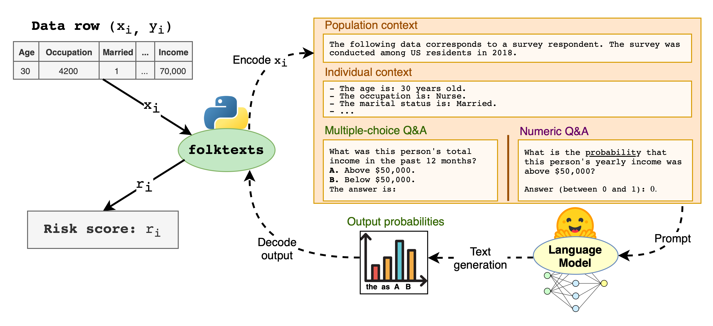
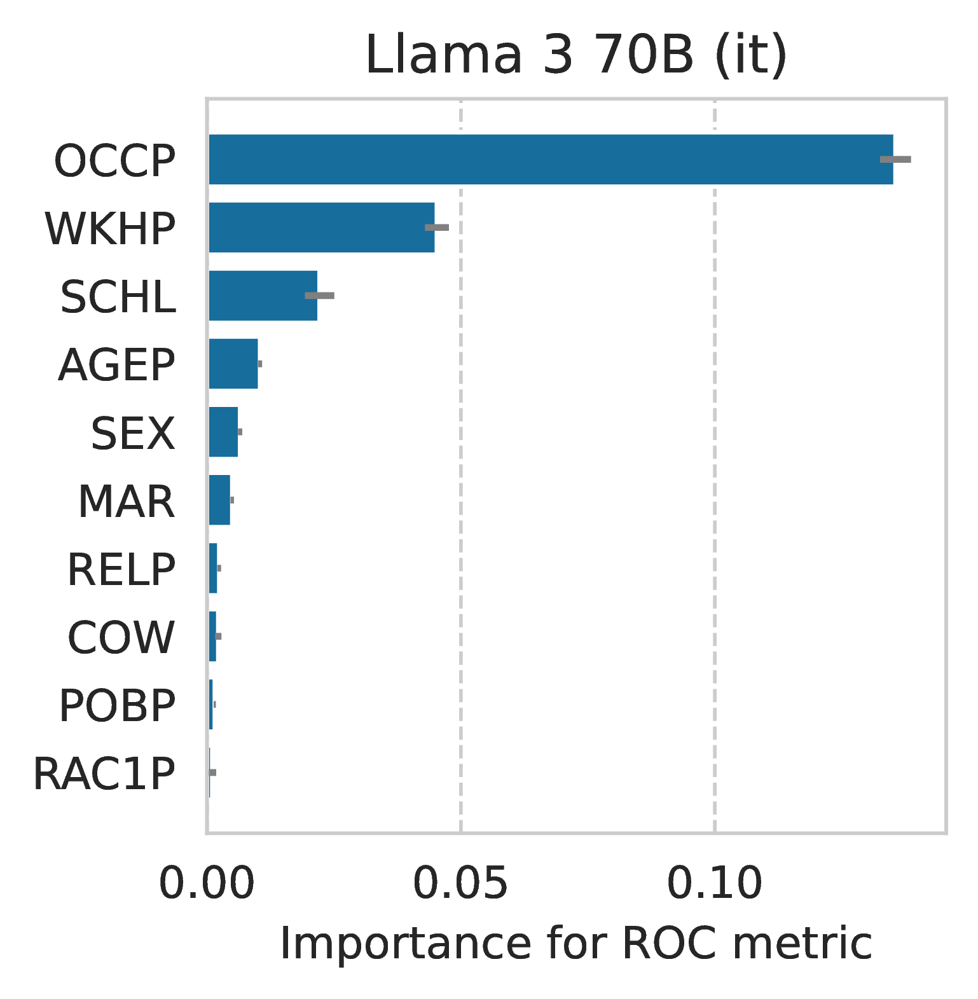

 <!-- # Folktexts   <!-- omit in toc -->


[](https://huggingface.co/datasets/acruz/folktexts)


<h2>A toolbox for evaluating statistical properties of LLMs</h2>

Folktexts provides a suite of Q&A datasets for evaluating **uncertainty**, **calibration**, **accuracy** and **fairness** of LLMs on individual outcome prediction tasks. It provides a flexible framework to derive prediction **tasks from survey data**, translates them into natural text prompts, extracts LLM-generated _risk scores_, and computes statistical properties of these risk scores by comparing them to the ground truth outcomes.

**Use folktexts to benchmark your LLM:**

- Pre-defined Q&A benchmark tasks are provided based on data from the American Community Survey (<a href="https://www.census.gov/programs-surveys/acs/microdata/documentation.html">ACS</a>). Each tabular prediction task from the popular
[folktables](https://github.com/socialfoundations/folktables) package is made available
as a natural-language Q&A task.
- Parsed and ready-to-use versions of each *folktexts* dataset can be found on
<a href="https://huggingface.co/datasets/acruz/folktexts"> Huggingface</a>.
- The package can be used to customize your tasks. Select a feature to define your prediction target. Specify subsets of input features to vary outcome uncertainty. Modify prompting templates to evaluate mappings from tabular data to natural text prompts. Compare different methods to extract uncertainty values from LLM responses. Extract raw risk scores and outcomes to perform custom statistical evaluations. Package documentation can be found [here](https://socialfoundations.github.io/folktexts/).

<!--  -->
<p align="center">
    
</p>

> **🆕 v0.6.0** adds typed, composable prompt configuration — build prompts from `PromptConfig` / `FewShotConfig` and vary the feature block with the `--variation` CLI flag; see [Configuring prompts](#configuring-prompts). The v0.4.0 [vLLM](https://github.com/vllm-project/vllm) backend remains the default local-inference path (`pip install 'folktexts[vllm]'`, CUDA GPU required). Full release notes in [`docs/updates.md`](docs/updates.md).


## Table of contents   <!-- omit in toc -->
- [Getting started](#getting-started)
  - [Installing](#installing)
  - [Basic setup](#basic-setup)
  - [Ready-to-use datasets](#ready-to-use-datasets)
  - [Example usage](#example-usage)
- [Benchmark features and options](#benchmark-features-and-options)
- [Configuring prompts](#configuring-prompts)
- [Evaluating feature importance](#evaluating-feature-importance)
- [FAQ](#faq)
- [Citation](#citation)
- [License and terms of use](#license-and-terms-of-use)


## Getting started

### Installing

Install package from [PyPI](https://pypi.org/project/folktexts/):

```
pip install folktexts
```

### Basic setup
> Go through the following steps to run the benchmark tasks.
> Alternatively, if you only want ready-to-use datasets, see [this section](#ready-to-use-datasets).

1. Create the environment and install folktexts

```
conda create -n folktexts python=3.11 && conda activate folktexts
pip install 'folktexts[vllm]'    # drop the [vllm] extra to skip the default GPU backend
```

2. Create the working folders and download a model

```
mkdir results models data
download_models --model 'google/gemma-2b' --save-dir models
```

3. Run a benchmark task

```
run_acs_benchmark --results-dir results --data-dir data --task 'ACSIncome' --model models/google--gemma-2b
```

Run `run_acs_benchmark --help` to get a list of all available benchmark flags.

### Ready-to-use datasets
<details>
<summary>click to expand</summary>

Pre-rendered Q&A datasets generated from the 2018 American Community Survey are available on
<a href="https://huggingface.co/datasets/acruz/folktexts">
<span style="display: inline-block; vertical-align: middle;">
    
</span>
Hugging Face</a> — handy if you only need the prompts/labels and don't want to run the LLM scoring pipeline yourself.

```py
import datasets
acs_task_qa = datasets.load_dataset(
    path="acruz/folktexts",
    name="ACSIncome",   # Choose which task you want to load
    split="test")       # Choose split according to your intended use case
```

</details>


### Example usage

Load a model and produce risk scores on the test split using the default vLLM backend:

```py
from folktexts.llm_utils import load_vllm_model
from folktexts.classifier import VLLMClassifier
from folktexts.acs import ACSDataset

# BF16 + gpu_memory_utilization=0.85 by default; tune `max_model_len` for your VRAM.
llm, tokenizer = load_vllm_model("/path/to/model", max_model_len=2048)

clf = VLLMClassifier(
    llm=llm, tokenizer=tokenizer,
    task="ACSIncome",
    model_name_or_path="/path/to/model",
)

dataset = ACSDataset.make_from_task("ACSIncome")    # `.subsample(0.01)` for faster approximate results
X_test, y_test = dataset.get_test()
test_scores = clf.predict_proba(X_test)
```

`VLLMClassifier`, `TransformersLLMClassifier`, and `WebAPILLMClassifier` all expose the
same `.predict_proba` / `.predict` / `.fit` interface — switching backends is a one-line
change to how the model is loaded.

<details>
<summary><strong>Using the 🤗 transformers backend instead</strong> (click to expand)</summary>

```py
from folktexts.llm_utils import load_model_tokenizer
from folktexts.classifier import TransformersLLMClassifier

model, tokenizer = load_model_tokenizer("gpt2")     # tiny model for example
clf = TransformersLLMClassifier(model=model, tokenizer=tokenizer, task="ACSIncome")
```

For web-hosted models (OpenAI, Anthropic, ...), use `WebAPILLMClassifier` with any
[litellm](https://docs.litellm.ai)-compatible identifier that exposes log-probabilities
(`pip install 'folktexts[apis]'`).

</details>

<details>
<summary><strong>Running the full benchmark suite</strong> (click to expand)</summary>

If you only care about overall metrics rather than per-row scores, use
`Benchmark.make_benchmark`. The backend is autodetected from the model handle
(vLLM `LLM` → `vllm`, HF `PreTrainedModel` → `transformers`, model-id string →
`webapi`); pass `backend=` explicitly to override.

```py
from folktexts.benchmark import Benchmark
bench = Benchmark.make_benchmark(
    task="ACSIncome", dataset=dataset,
    model=llm, tokenizer=tokenizer,
    numeric_risk_prompting=True,    # see the options table below for the full list
)
bench_results = bench.run(results_root_dir="results")
```

</details>

<details>
<summary><strong>Chain-of-thought prompting</strong> (click to expand)</summary>

The model generates free-form reasoning text before emitting a probability,
which is then extracted via regex. `enable_thinking=True` is a sub-option of
chain-of-thought that activates the Qwen3-style thinking-mode chat template and
strips the `<think>` block before extraction; setting it on its own enables
chain-of-thought automatically (with a warning).

```py
from folktexts.benchmark import Benchmark, BenchmarkConfig

config = BenchmarkConfig(cot_prompting=True, enable_thinking=True)
bench = Benchmark.make_benchmark(
    task="ACSIncome", dataset=dataset,
    model=llm, tokenizer=tokenizer, config=config,
)
bench_results = bench.run(results_root_dir="results")
```

</details>

<details>
<summary><strong>Fitting a binarization threshold</strong> (click to expand)</summary>

Fit a decision threshold on a small training slice (this is *not* fine-tuning —
only the post-hoc threshold is learned), then call `.predict()` for discretized
labels:

```py
clf.fit(*dataset[0:100])    # `dataset[...]` indexes into training data
test_preds = clf.predict(X_test)
```

</details>


## Benchmark features and options
<details>
<summary>click to expand</summary>

Here's a summary list of the most important benchmark options/flags used in
conjunction with the `run_acs_benchmark` command line script, or with the
`Benchmark` class.

| Option | Description | Examples |
|:---|:---|:---:|
| `--model` | Name of the model on huggingface transformers, or local path to folder with pretrained model and tokenizer. Can also use web-hosted models with `"[provider]/[model-name]"`. | `meta-llama/Meta-Llama-3-8B`, `openai/gpt-4o-mini` |
| `--task` | Name of the ACS task to run benchmark on. | `ACSIncome`, `ACSEmployment`  |
| `--results-dir` | Path to directory under which benchmark results will be saved. | `results` |
| `--data-dir` | Root folder to find datasets in (or download ACS data to). | `~/data` |
| `--numeric-risk-prompting` | Whether to use verbalized numeric risk prompting, i.e., directly query model for a probability estimate. **By default** will use standard multiple-choice Q&A, and extract risk scores from internal token probabilities. | Boolean flag (`True` if present, `False` otherwise) |
| `--use-chat-template` | Format prompts using the tokenizer's chat template (recommended for instruct/chat models). Pair with `--system-prompt` and/or `--chat-prompt` to override the defaults. Mutually exclusive with `--cot-prompting`. **By default** uses zero-shot prompting without a chat template. | Boolean flag (`True` if present, `False` otherwise) |
| `--cot-prompting` | Use chain-of-thought (CoT) prompting: the model generates free-form reasoning text before outputting a probability estimate, which is extracted from the generated text via regex. | Boolean flag (`True` if present, `False` otherwise) |
| `--enable-thinking` | Enable thinking mode for tokenizers that support it (e.g. Qwen3). Only applies with `--cot-prompting`; calls `apply_chat_template(enable_thinking=True)` and strips the `<think>` block before extraction. | Boolean flag (`True` if present, `False` otherwise) |
| `--use-web-api-model` | Whether the given `--model` name corresponds to a web-hosted model or not. **By default** this is False (assumes a local model). If this flag is provided, `--model` must contain a [litellm](https://docs.litellm.ai) model identifier ([examples here](https://docs.litellm.ai/docs/providers/openai#openai-chat-completion-models)). | Boolean flag (`True` if present, `False` otherwise) |
| `--inference-backend` | Local inference backend. **Default** `vllm` for high-throughput continuous batching (requires `pip install 'folktexts[vllm]'` and a CUDA GPU); pass `transformers` to use the HuggingFace path instead. Ignored when `--use-web-api-model` is set. | `vllm`, `transformers` |
| `--gpu-memory-utilization` | vLLM only. Fraction of GPU VRAM vLLM may pre-allocate for KV cache. Lower if vLLM OOMs at startup. | `0.85` (default) |
| `--max-model-len` | vLLM only. Maximum tokens (input + output) per request. Defaults to `--context-size + ChainOfThoughtQA.max_new_tokens + 256` for CoT runs (600 + 8000 + 256 = 8856 with the default `--context-size` of 600), otherwise `--context-size + 1 + 256`. Override on tighter VRAM. | `2048`, `8192` |
| `--vllm-dtype` | vLLM only. Compute dtype. | `auto`, `bfloat16`, `float16` |
| `--tensor-parallel-size` | vLLM only. Number of GPUs to shard the model across; auto-detects from `CUDA_VISIBLE_DEVICES`. | `1`, `2` |
| `--subsampling` | Which fraction of the dataset to use for the benchmark. **By default** will use the whole test set. | `0.01` |
| `--fit-threshold` | Whether to use the given number of samples to fit the binarization threshold. **By default** will use a fixed $t=0.5$ threshold instead of fitting on data. | `100` |
| `--batch-size` | The number of samples to process in each inference batch. Choose according to your available VRAM. | `10`, `32` |

<details>
<summary><strong>Full list of options</strong> (click to expand)</summary>

```
usage: run_acs_benchmark [-h] --model MODEL --results-dir RESULTS_DIR --data-dir DATA_DIR [--task TASK] [--few-shot FEW_SHOT] [--batch-size BATCH_SIZE] [--context-size CONTEXT_SIZE] [--fit-threshold FIT_THRESHOLD] [--subsampling SUBSAMPLING] [--seed SEED] [--use-web-api-model] [--inference-backend {transformers,vllm}] [--gpu-memory-utilization GPU_MEMORY_UTILIZATION] [--max-model-len MAX_MODEL_LEN] [--vllm-dtype VLLM_DTYPE] [--tensor-parallel-size TENSOR_PARALLEL_SIZE] [--dont-correct-order-bias] [--numeric-risk-prompting] [--cot-prompting] [--enable-thinking] [--reuse-few-shot-examples] [--compose-few-shot-examples COMPOSE_FEW_SHOT_EXAMPLES] [--example-order EXAMPLE_ORDER] [--few-shot-hide-question] [--variation [VARIATION ...]] [--use-chat-template] [--chat-prompt CHAT_PROMPT] [--system-prompt SYSTEM_PROMPT]
                         [--use-feature-subset USE_FEATURE_SUBSET] [--use-population-filter USE_POPULATION_FILTER] [--max-api-rpm MAX_API_RPM] [--logger-level {DEBUG,INFO,WARNING,ERROR,CRITICAL}]

Benchmark risk scores produced by a language model on ACS data.

options:
  -h, --help            show this help message and exit
  --model MODEL         [str] Model name or path to model saved on disk
  --results-dir RESULTS_DIR
                        [str] Directory under which this experiment's results will be saved
  --data-dir DATA_DIR   [str] Root folder to find datasets on
  --task TASK           [str] Name of the ACS task to run the experiment on
  --few-shot FEW_SHOT   [int] Use few-shot prompting with the given number of shots
  --batch-size BATCH_SIZE
                        [int] The batch size to use for inference
  --context-size CONTEXT_SIZE
                        [int] The maximum context size when prompting the LLM
  --fit-threshold FIT_THRESHOLD
                        [int] Whether to fit the prediction threshold, and on how many samples
  --subsampling SUBSAMPLING
                        [float] Which fraction of the dataset to use (if omitted will use all data)
  --seed SEED           [int] Random seed -- to set for reproducibility
  --use-web-api-model   [bool] Whether use a model hosted on a web API (instead of a local model)
  --inference-backend {transformers,vllm}
                        [str] Local inference backend to use; default is 'vllm'. Pass 'transformers' to fall back to the HuggingFace path. Ignored when --use-web-api-model is set.
  --gpu-memory-utilization GPU_MEMORY_UTILIZATION
                        [float] vLLM gpu_memory_utilization (default 0.85). Lower if vLLM OOMs at startup.
  --max-model-len MAX_MODEL_LEN
                        [int] vLLM max_model_len (input + output tokens). If unset, derived from --context-size + ChainOfThoughtQA.max_new_tokens for the prompting mode (currently 8000 for CoT/thinking, 1 otherwise).
  --vllm-dtype VLLM_DTYPE
                        [str] vLLM compute dtype (auto/bfloat16/float16/float32).
  --tensor-parallel-size TENSOR_PARALLEL_SIZE
                        [int] vLLM tensor_parallel_size. If unset, auto-detected from CUDA_VISIBLE_DEVICES (1 if unset).
  --dont-correct-order-bias
                        [bool] Whether to avoid correcting ordering bias, by default will correct it
  --numeric-risk-prompting
                        [bool] Whether to prompt for numeric risk-estimates instead of multiple-choice Q&A
  --cot-prompting       [bool] Whether to use chain-of-thought (CoT) prompting where the model reasons step-by-step before outputting a probability
  --enable-thinking     [bool] Whether to enable thinking mode for tokenizers that support it (e.g., Qwen3). Only applies with --cot-prompting
  --reuse-few-shot-examples
                        [bool] Whether to reuse the same samples for few-shot prompting (or sample new ones every time)
  --compose-few-shot-examples COMPOSE_FEW_SHOT_EXAMPLES
                        [str|list] How to select samples in few-shot prompting: random, balanced or a list of specified class counts. Defaults to random.
  --example-order EXAMPLE_ORDER
                        [str] Comma-separated permutation of few-shot example indices, e.g. '2,0,1'. Only used when --few-shot is set.
  --few-shot-hide-question
                        [bool] In few-shot examples show only the answer (omit the repeated question). By default each example includes the question. Only used when --few-shot is set.
  --variation [VARIATION ...]
                        [dict] Prompt-style overrides as key=value pairs, e.g. --variation connector=is format=bullet (keys: format, connector, granularity, order, custom_prompt_prefix, custom_prompt_suffix, show_question).
  --use-chat-template   [bool] Whether to format prompts using the tokenizer's chat template (for instruct/chat models)
  --chat-prompt CHAT_PROMPT
                        [str] Custom assistant prefill text to use with chat templates
  --system-prompt SYSTEM_PROMPT
                        [str] Custom system prompt text to use with chat templates
  --use-feature-subset USE_FEATURE_SUBSET
                        [str] Optional subset of features to use for prediction, comma separated
  --use-population-filter USE_POPULATION_FILTER
                        [str] Optional population filter for this benchmark; must follow the format 'column_name=value' to filter the dataset by a specific value.
  --max-api-rpm MAX_API_RPM
                        [int] Maximum number of API requests per minute (if using a web-hosted model)
  --logger-level {DEBUG,INFO,WARNING,ERROR,CRITICAL}
                        [str] The logging level to use for the experiment
```

</details>

</details>


## Configuring prompts

Every prompt that `folktexts` builds for a tabular row is composed of three parts:

```
[PREFIX]  task description                (constant across rows)
[INFO]    serialized feature-value pairs  (row-specific)
[SUFFIX]  question text + answer prefill  (constant)
```

The *answer prefill* is the fixed lead-in the prompt ends on (e.g. `Answer:`), so
the next token the model emits is the answer we score; in chat mode it becomes the
assistant's opening turn instead.

These parts are set through a single `PromptConfig` object (plus `FewShotConfig`
for in-context examples), built once and passed down unchanged.

The defaults reproduce the original paper's prompts exactly — you only need this
section if you want to *change* how prompts are rendered. Every knob below is also
available from Python; see the
[prompt-configuration guide](https://socialfoundations.github.io/folktexts/configuring_prompts.html)
for the full `PromptConfig` / `FewShotConfig` reference and a migration note from
the older flat-keyword API (`custom_prompt_prefix`, `class_balancing`, …).

<details>
<summary>CLI reference — question modes, <code>--variation</code>, few-shot, chat (click to expand)</summary>

### Question modes

Each run asks one of three kinds of question:

| Mode | Flag | What the model does |
|:---|:---|:---|
| Multiple-choice | *(default)* | Picks an answer choice; we score the answer-letter tokens. |
| Numeric | `--numeric-risk-prompting` | Reports the probability directly (`Answer (between 0 and 1): 0.…`). |
| Chain-of-thought | `--cot-prompting` | Reasons step-by-step, then ends with a `Probability: X%` line. Add `--enable-thinking` for Qwen3-style thinking mode. |

The mode is independent of the delivery path — zero-shot (default), `--few-shot`,
or `--use-chat-template`. Two combinations raise an error: `--few-shot` with
`--use-chat-template`, and `--cot-prompting` with `--use-chat-template` (CoT
applies the chat template itself). Chain-of-thought runs zero-shot (it is not
combined with `--few-shot`); multiple-choice and numeric work with every delivery
path.

### Varying the feature block — `--variation`

The `--variation` flag takes one or more `key=value` overrides that change how
the `[INFO]` block is rendered. Keys (with their defaults) are:

| Key | Default | Allowed values | Effect |
|:---|:---|:---|:---|
| `format` | `textbullet` | `textbullet`, `bullet`, `comma`, `text` | Layout of the feature list: `textbullet` → `- The Age is: 42.`, `bullet` → `- Age is: 42`, `comma` → `Age is: 42, …`. |
| `connector` | `is:` | any string, e.g. `is`, `=`, `:` | Separator between a feature label and its value. |
| `granularity` | `original` | `original`, `low` | `low` coarsens ACS feature values into broader bins (age ranges, grouped occupations). ACS-only. |
| `order` | *(original)* | comma-separated column names | Reorders features: the named columns come first, the rest are appended (nothing is dropped). |
| `custom_prompt_prefix` | *(none)* | any string | Extra text inserted after the task description and before the feature block. |
| `custom_prompt_suffix` | *(none)* | any string | Extra text appended after the question / answer prefill (it does not replace the question — use `show_question=false` for that). |
| `show_question` | `true` | `true`, `false` | When `false`, drops the repeated question and relies on the answer prefill. |

```sh
# Plain bullets, "=" between each label and value, age/education first
# (connector== sets the separator to the literal "="):
run_acs_benchmark --model "$MODEL" --task ACSIncome --results-dir results \
    --variation format=bullet connector== order=AGEP,SCHL,COW

# Coarser feature values (low granularity) rendered as a comma-separated list:
run_acs_benchmark --model "$MODEL" --task ACSIncome --results-dir results \
    --variation granularity=low format=comma
```

Each distinct variation produces its own deterministic results-file name, so
runs never overwrite one another.

### Few-shot examples

Few-shot prompting is enabled with `--few-shot N` and tuned with:

| Flag | Effect |
|:---|:---|
| `--reuse-few-shot-examples` | Reuse the same `N` examples for every row (faster, deterministic) instead of resampling. |
| `--compose-few-shot-examples` | How examples are drawn: `random` (default), `balanced` (equal per class), or per-class counts in label order like `2,2` (2 of class 0, 2 of class 1). |
| `--example-order` | Comma-separated permutation of the example indices, e.g. `3,2,1,0`. |
| `--few-shot-hide-question` | Show only the answer in each example (omit the repeated question). |

```sh
run_acs_benchmark --model "$MODEL" --task ACSIncome --results-dir results \
    --few-shot 4 --compose-few-shot-examples balanced --reuse-few-shot-examples
```

> Few-shot prompting cannot be combined with `--use-chat-template` (raises an error).

### Chat, system prompt, and chain-of-thought

`--use-chat-template` formats prompts with the tokenizer's chat template; pair it
with `--system-prompt "..."` and/or `--chat-prompt "..."` to override the role
text. Passing `--system-prompt` or `--chat-prompt` without `--use-chat-template`
has no effect and warns. `--cot-prompting` is its own generation path (see
**Question modes**) and is mutually exclusive with `--use-chat-template`.

</details>


## Evaluating feature importance
<details>
<summary>click to expand</summary>

By evaluating LLMs on tabular classification tasks, we can use standard feature importance methods to assess which features the model uses to compute risk scores.

You can do so yourself by calling `folktexts.cli.eval_feature_importance` (add `--help` for a full list of options).

Here's an example for the Llama3-70B-Instruct model on the ACSIncome task (*warning: takes 24h on an Nvidia H100*):
```
python -m folktexts.cli.eval_feature_importance --model 'meta-llama/Meta-Llama-3-70B-Instruct' --task ACSIncome --subsampling 0.1
```
<div style="text-align: center;">

</div>

This script uses sklearn's [`permutation_importance`](https://scikit-learn.org/stable/modules/generated/sklearn.inspection.permutation_importance.html#sklearn.inspection.permutation_importance) to assess which features contribute the most for the ROC AUC metric (other metrics can be assessed using the `--scorer [scorer]` parameter).

</details>


## FAQ
<details>
<summary>click to expand</summary>

1.
    **Q:** Can I use `folktexts` with a different dataset?

    **A:** **Yes!** Folktexts provides the whole ML pipeline needed to produce risk scores using LLMs, together with a few example ACS datasets. You can easily apply these same utilities to a different dataset following the [example jupyter notebook](notebooks/custom-dataset-example.ipynb).


2.
    **Q:** How do I create a custom prediction task based on American Community Survey data?

    **A:** Simply create a new `TaskMetadata` object with the parameters you want. Follow the [example jupyter notebook](notebooks/custom-acs-task-example.ipynb) for more details.


3.
    **Q:** Can I use `folktexts` with closed-source models?

    **A:** **Yes!** Local LLMs run on a high-throughput [vLLM](https://github.com/vllm-project/vllm) backend by default (install with `pip install 'folktexts[vllm]'`); pass `--inference-backend transformers` to fall back to the [🤗 transformers](https://github.com/huggingface/transformers) path. Web-hosted LLMs are supported via [litellm](https://github.com/BerriAI/litellm) — for example, `--model='gpt-4o' --use-web-api-model` runs GPT-4o through the OpenAI API. [Here's a complete list](https://docs.litellm.ai/docs/providers/openai#openai-chat-completion-models) of compatible OpenAI models. Note that some models are not compatible as they don't enable access to log-probabilities.
    Using models through a web API requires installing extra optional dependencies with `pip install 'folktexts[apis]'`.


4.
    **Q:** Can I use `folktexts` to fine-tune LLMs on survey prediction tasks?

    **A:** The package does not feature specific fine-tuning functionality, but you can use the data and Q&A prompts generated by `folktexts` to fine-tune an LLM for a specific prediction task.

    <!-- **A:** Yes. Although the package does not feature specific fine-tuning functionality, you can use the data and Q&A prompts generated by `folktexts` to fine-tune an LLM for a specific prediction task. Follow the [example jupyter notebook](notebooks/finetuning-llms-example.ipynb) for more details. In the future we may bring this functionality into the main package implementation. -->

</details>


## Citation

```bib
@inproceedings{cruz2024evaluating,
    title={Evaluating language models as risk scores},
    author={Andr\'{e} F. Cruz and Moritz Hardt and Celestine Mendler-D\"{u}nner},
    booktitle={The Thirty-eight Conference on Neural Information Processing Systems Datasets and Benchmarks Track},
    year={2024},
    url={https://openreview.net/forum?id=qrZxL3Bto9}
}
```


## License and terms of use

Code licensed under the [MIT license](LICENSE).

The American Community Survey (ACS) Public Use Microdata Sample (PUMS) is
governed by the U.S. Census Bureau [terms of service](https://www.census.gov/data/developers/about/terms-of-service.html).
